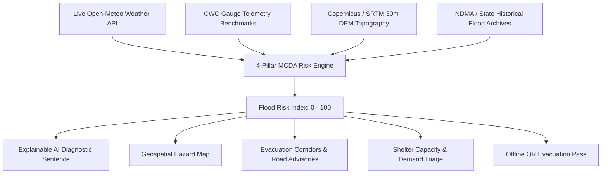

# 🌊 FloodGuard AI
> **AI-Powered Flood Prediction, Decision Support & Evacuation Planning System for India**

---

## 1. FloodGuard AI

**FloodGuard AI** is a decision-support web application designed to help emergency disaster coordinators, district magistrates, and vulnerable riverine communities anticipate flood risks and execute timely, safe evacuations. By synthesizing real-time meteorological feeds, river gauge telemetry benchmarks, regional digital elevation models (DEM), and documented historical disaster patterns, FloodGuard AI translates raw environmental data into actionable, life-saving intelligence.

> **Hackathon Prototype Notice**: FloodGuard AI is an academic and hackathon decision-support prototype. It demonstrates multi-criteria predictive methodology and is **not** a certified government emergency warning system.

---

## 2. Problem Statement

Flooding causes catastrophic loss of life, livelihoods, and critical infrastructure across India every year:
* The **Brahmaputra** deluges Assam plains and Kaziranga annually.
* The dynamic **Kosi River** ("Sorrow of Bihar") avulses embankments across North Bihar.
* Heavy Western Ghats downpours and dam spillways overwhelm the **Periyar** basin in Kerala.
* Extreme urban cloudbursts and high-tide locks paralyze Mumbai's **Mithi River** network.
* Cyclonic depressions over the Bay of Bengal trigger vast deltas to submerge along the **Mahanadi** in Odisha.

**The Core Challenge**: Traditional warnings are often delivered as static, text-heavy bulletins without clear spatial context, making it difficult for local administrators and citizens to assess hyper-local flood depth, time-to-peak, road passability, and optimal high-ground shelter routing.

---

## 3. Solution

FloodGuard AI addresses this challenge with a unified, real-time command dashboard that:
1. **Monitors Live Weather**: Ingests live precipitation data via the Open-Meteo API.
2. **Tracks River Telemetry**: Models gauge levels against official Central Water Commission (CWC) warning and danger thresholds.
3. **Applies Topographical Modeling**: Evaluates terrain slope gradients and mean sea level (MSL) elevation using Copernicus and NASA SRTM 30m DEM data.
4. **Calculates Multi-Criteria Risk**: Generates a unified **Flood Risk Index (FRI: 0–100)** with plain-language, explainable AI diagnoses.
5. **Directs Evacuations**: Recommends high-ground relief camps, evaluates road accessibility, and maps safe evacuation corridors.

---

## 4. Key Features

* **⚡ 2-Minute Hackathon Judge Guided Tour**: A dedicated 4-step interactive walkthrough for evaluators to test data telemetry, AI calculation, stress simulation, and evacuation triage in under 2 minutes.
* **🗺️ Interactive Geospatial Hazard Map**: Visualizes the selected river basin, active river channel alignment, low alluvial floodplain zones, dynamic inundation hazard footprints, high-ground safe havens, and designated evacuation corridor polylines.
* **📊 Transparent MCDA AI Risk Engine**: Calculates a composite Flood Risk Index ($0 - 100$) with verified mathematical consistency ($35\%$ Hydrology, $30\%$ Weather, $20\%$ Topography, $15\%$ History).
* **🧠 Plain-Language Explainable AI**: Produces human-readable diagnostic summaries explaining *why* an alert level was triggered and what primary factors drove it.
* **📈 Hydrological & Meteorological Analytics**: Visualizes CWC hydrographs with danger thresholds, 72-hour precipitation forecast curves, and documented historical flood archives.
* **🛡️ Dynamic Evacuation & Shelter Center**: Ranks safe relief shelters based on elevation safety margins and remaining capacities. Shelter occupancy and road conditions dynamically adjust to simulated flood severity.
* **🎛️ "What-If" Scenario Stress Simulator**: Test real-time sensitivity using 4 calibrated scenarios (+25% rain, +0.5m river rise, compound inflow surge, and catastrophic cloudburst + dam spillway overtopping).
* **📱 Priority Offline Evacuation Pass**: Generate and download an emergency evacuation pass equipped with an offline QR verification token.
* **🧰 72-Hour Survival Kit Readiness**: An interactive checklist for emergency go-bag supplies (water, non-perishables, medical kits, battery banks).
* **🌐 Bilingual Support & Direct SOS**: Full English and हिन्दी localization with 1-click access to NDRF, SDRF, State EOC, and Pan-India 112 emergency routing.

---

## 5. How It Works

1. **Data Ingestion**: Weather parameters (observed 24h rain, 6h bursts, 72h forecasts) are pulled live from Open-Meteo. River gauge levels and historical susceptibility baselines are loaded for the selected Indian basin.
2. **Multi-Factor Processing**: Each environmental factor is normalized on a $0 - 100$ scale.
3. **Deterministic MCDA Fusion**: Weighted linear aggregation computes the composite index.
4. **Geospatial & Directive Synthesis**: The Flood Risk Index determines the inundation buffer radius on the map, adjusts shelter intake demand, and issues risk-tiered evacuation directives.

---

## 6. AI / MCDA Risk Model

The **Flood Risk Index (FRI)** is calculated using Multi-Criteria Decision Analysis (MCDA):

$$\text{FRI} = \text{round}\left(S_{\text{hydrology}} \times 0.35 + S_{\text{weather}} \times 0.30 + S_{\text{topography}} \times 0.20 + S_{\text{historical}} \times 0.15\right)$$

### Component Breakdown
| Factor | Weight | Inputs / Driving Variables |
| :--- | :---: | :--- |
| **Hydrology** | **35%** | Current river level vs. CWC Danger Mark ($\Delta m$), rate of water level rise ($m/\text{hr}$), and flow discharge ($cusecs$). |
| **Weather** | **30%** | Observed 24h rainfall ($mm$), short-term 6h burst accumulation, 72h forecast precipitation, and precipitation probability. |
| **Topography** | **20%** | Mean sea level elevation ($m$ MSL), terrain slope gradient ($\%$, where flatter slopes $\le 1\%$ increase water stagnation), and soil drainage index. |
| **Historical Susceptibility** | **15%** | Documented recurrence frequency (e.g., $1.2\text{ yr}$ return periods in Assam/Bihar vs. $3.0\text{ yr}$ in Kerala) and severity history. |

### Early Warning Classification Tiers
* 🟢 **LOW (0 – 25)**: *Normal Vigilance* — River within safe embankments; standard routine monitoring; verify household 72h emergency kits.
* 🟡 **MODERATE (26 – 50)**: *Yellow Advisory* — Elevated water volume; low-lying riverbed fields and chars/diaras advised to prepare essential kits and secure livestock.
* 🟠 **HIGH (51 – 75)**: *Orange Warning* — Water stage approaching critical danger mark; deploy Quick Response Teams (QRT); initiate staged relocation of vulnerable groups to high-ground camps.
* 🔴 **SEVERE (76 – 100)**: *Critical Red Alert* — River breaching danger mark with heavy rain saturation; mandatory floodplain evacuation; NDRF/SDRF rescue boat deployment; emergency contacts (112, 1077) highlighted.

---

## 7. Data Sources

| Domain | Provenance | Source / Provider | Details |
| :--- | :---: | :--- | :--- |
| **Precipitation & Weather** | **`LIVE API`** | [Open-Meteo Global Weather API](https://open-meteo.com/) | Real-time 24h precipitation sum, hourly forecasts, temperature, relative humidity, and precipitation probability. |
| **River Gauge Levels** | **`DEMO / SIMULATED`** | Central Water Commission (CWC) Official Benchmarks | Water levels, warning levels, danger levels, and Highest Flood Levels (HFL) modeled deterministically around authentic CWC gauge thresholds. |
| **Topography & Elevation** | **`PUBLIC DATASET`** | Copernicus Global DEM & NASA SRTM 30m Grid | Mean sea level elevation, terrain slope gradients, and soil drainage permeability indices. |
| **Historical Flood Events** | **`PUBLIC DATASET`** | NDMA, ASDMA, BSDMA, KSDMA & Chitale Committee | Documented flood levels, casualties, population displacement figures, and root causes from historical disasters (1988, 2001, 2005, 2008, 2012, 2018, 2020). |
| **Emergency Helplines** | **`PUBLIC DATASET`** | National Disaster Response Force (NDRF) & SEOC | Verified 24x7 emergency control room phone numbers and contact details. |

> **Important Disclosure**: The Central Water Commission (CWC) of India does not currently provide an open, free CORS-enabled REST API for real-time sensor streams. FloodGuard AI transparently models river telemetry against authentic CWC station warning and danger marks.

---

## 8. Technology Stack

* **Framework & UI**: [React 18](https://react.dev/) + [TypeScript](https://www.typescriptlang.org/)
* **Build Tool**: [Vite 5](https://vitejs.dev/)
* **Styling & Theme**: [Tailwind CSS 3](https://tailwindcss.com/) (Custom dark disaster-management command interface)
* **Geospatial Mapping**: [Leaflet GIS](https://leafletjs.com/) with CartoDB Voyager tiles, vector polylines, and dynamic SVG markers
* **Data Visualization**: [Recharts](https://recharts.org/) (Interactive hydrographs, rainfall bar charts, and historical flood trend lines)
* **Icons**: [Lucide React](https://lucide.dev/)
* **Deployment**: [Vercel](https://vercel.com/)

---

## 9. Evacuation & Shelter Support

FloodGuard AI bridges the gap between warning alerts and actionable evacuation:
* **Shelter Triage**: Evaluates relief camps by safety elevation margin ($+15\text{m}$ to $+43\text{m}$ above flood level), current occupancy percentage, medical posts, clean water, and power backup.
* **Dynamic Capacity Response**: Under **SEVERE** flood risk, shelter occupancy dynamically surges ($+65\%$) to reflect real-world influx into high-ground camps.
* **Road Accessibility**: Identifies safe, high-ridge arterial corridors while warning against low-lying bypasses, submerged railway underpasses, and unreinforced earthen river embankments.
* **Priority Evacuation Pass**: Offline-capable pass generator featuring household member counts, assigned shelter details, and quick QR verification.

---

## 10. What-If Scenario Simulator

The built-in **Scenario Simulator** allows disaster response planners and hackathon judges to stress-test the risk model under hypothetical extreme conditions:
* **Scenario A (+25% Rain)**: Simulates a moderate precipitation surge ($+25\text{mm}$ rain load); FRI typically rises $+6$ to $+8$ points.
* **Scenario B (+0.5m River Rise)**: Models hydrological upstream surge raising water stage by $+0.5\text{m}$; FRI rises $+9$ to $+12$ points.
* **Scenario C (Rain + River Surge)**: Compound inflow ($+65\text{mm}$ rain, $+1.3\text{m}$ river rise, $75\%$ drainage); triggers an immediate **ORANGE HIGH ALERT** (FRI $\sim 76/100$), expanding the inundation footprint and recommending staged evacuation.
* **Scenario D (Compound Catastrophe)**: Extreme cloudburst ($+140\text{mm}$ to $+160\text{mm}$), dam spillway release ($+2.4\text{m}$ to $+2.8\text{m}$), and heavily choked drainage ($35\%$); instantly surges the FRI to **CRITICAL RED ALERT** ($90 - 95/100$), causing shelter occupancy to jump to capacity ($>90\%$) and marking low-elevation access roads as `FLOODED`.

---

## 11. Safety & Limitations

1. **Hackathon Prototype**: FloodGuard AI is an educational proof-of-concept and decision-support prototype. It is **not** an officially certified early warning service.
2. **No Guarantee of 100% Accuracy**: Environmental conditions involve chaotic non-linear variables. Predictions represent risk estimates and must never be treated as definitive guarantees.
3. **Follow Official Directives**: In real-world emergency scenarios, always adhere strictly to official bulletins issued by:
   * **India Meteorological Department (IMD)**
   * **Central Water Commission (CWC)**
   * **National Disaster Management Authority (NDMA)**
   * Local Police, SDRF, and District Disaster Management Authorities (DDMA).
4. **Synthetic Flood Footprints**: Real-time 2D hydrodynamic modeling (e.g., HEC-RAS) requires significant GPU/supercomputing infrastructure. Spatial inundation footprints in this prototype are calculated from DEM slopes and risk index buffer radii.

---

## 12. Live Demo

Experience the live deployed web application:  
🔗 **[https://floodguard-ai-navy.vercel.app](https://floodguard-ai-navy.vercel.app)**

---

## 13. GitHub Repository

Inspect the source code, architecture, and verification test suites:  
📂 **[https://github.com/redwan1209/FloodGuard-AI](https://github.com/redwan1209/FloodGuard-AI)**

---

## 14. Developer

* **Developer**: **Redwan Hossen**
* **Role**: **AI & Full-Stack Developer**
* **Mission**: Engineered FloodGuard AI for the 2026 Hackathon to provide transparent, explainable flood intelligence and actionable evacuation support for high-risk river basins across India.
* **GitHub**: [@redwan1209](https://github.com/redwan1209)
* **LinkedIn**: [Redwan Hossen](https://linkedin.com)

---

*Built with ❤️ for Indian Disaster Resilience & Humanitarian Technology.*
